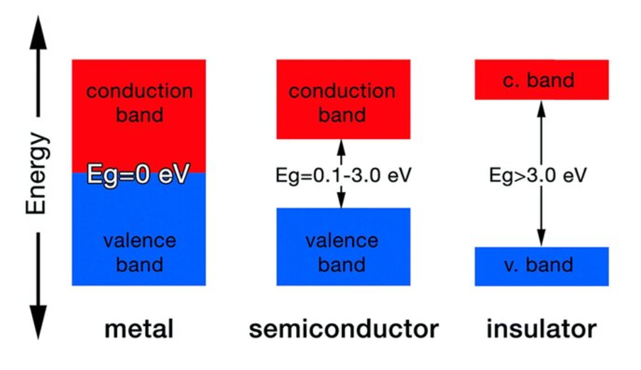

### Band Gap and Band Alignment Prediction of Semiconductors using Machine Learning

*This project is ongoing and subject to continuous advancements and modifications.*

## Overview
BandGapAlign is a machine learning project focused on predicting the band gap and band alignment properties of semiconductors. This tool aims to support material scientists and researchers by providing reliable predictions based on semiconductor features, enabling more efficient discovery of materials for electronic and optoelectronic applications.




## Features
- Predicts band gap values of semiconductors
- Provides band alignment classifications
- Utilizes machine learning algorithms for accurate prediction

## Installation

Clone this repository:
```bash
git clone https://github.com/Adrita-Khan/BandGapAlign.git
cd BandGapAlign
```
---

## Search Query on Google Scholar for Relevant Materials

Use the following search query on Google Scholar to find academic papers and research on band gap and band alignment predictions in semiconductors using machine learning:

```bash
"band gap" "band alignment" "semiconductor" "machine learning"
```

```bash
"band gap" "band alignment" "semiconductor" "deep learning"
```

This query will help to locate papers that discuss:

- Band gap predictions
- Band alignment in semiconductors
- Applications of machine learning in material science


## License

*This project is licensed under the MIT License.*

---

The references can be found [here](References.md).


## Notable References

1. Band gap and band alignment prediction of nitride-based semiconductors using machine learning (Huang2019)
2. Bandgap prediction by deep learning in configurationally hybridized graphene and boron nitride (Dong2019)

---


## Resources

1. [Video 1](https://www.youtube.com/watch?v=DxQbakJXHMU)
2. [Video 2](https://www.youtube.com/watch?v=dJRpjK1UyPI&t=192s)
3. [Video 3](https://www.youtube.com/watch?v=dU123Uc7HlI)
4. [Video 4](https://www.youtube.com/watch?v=qg3ju4nqqoQ)
5. [Video 5](https://www.youtube.com/watch?v=vVXD1Ds4Efk)
6. [Video 7](https://www.youtube.com/watch?v=JYz51Wq3yEo)

## Database

- [Matminer Datasets](https://hackingmaterials.lbl.gov/matminer/matminer.datasets.html): A collection of datasets for materials informatics research, provided by the Hacking Materials Project.
- [Next-Generation Materials Project](https://next-gen.materialsproject.org/): A comprehensive resource for materials data, supporting computational materials science and discovery.


## GitHub Repositories for Similar Works

Here is a curated list of GitHub repositories related to bandgap prediction using machine learning techniques:

1. [Band-Gap-Prediction-Using-ML](https://github.com/aydinerol/Band-Gap-Prediction-Using-ML)  
   **Description:** Repository by `aydinerol` focused on predicting band gaps using machine learning.

2. [Band_Gap_Machine_Learning](https://github.com/tianshi-wang/Band_Gap_Machine_Learning)  
   **Description:** Repository by `tianshi-wang` showcasing ML techniques for bandgap prediction.

3. [Material-Band-Gap-Prediction](https://github.com/ShashankRapolu07/Material-Band-Gap-Prediction)  
   **Description:** Repository by `ShashankRapolu07` aimed at predicting material band gaps using ML.

4. [Machine-learning-enabled-band-gap-prediction](https://github.com/gaochanut/Machine-learning-enabled-band-gap-prediction)  
   **Description:** Repository by `gaochanut` leveraging ML for bandgap predictions.

5. [Band_gap-prediction-using-machine-learning](https://github.com/PrathameshSonar2000/Band_gap-prediction-using-machine-learning)  
   **Description:** Repository by `PrathameshSonar2000` exploring ML approaches for bandgap predictions.

6. [Band-Gap-Prediction-via-Machine-Learning-Techniques](https://github.com/jairothoniel/Band-Gap-Prediction-via-Machine-Learning-Techniques)  
   **Description:** Repository by `jairothoniel` detailing machine learning methods for predicting band gaps.

7. [BandGap_Predictor (by Ezhilvel)](https://github.com/Ezhilvel/BandGap_Predictor)  
   **Description:** Repository by `Ezhilvel` on building a bandgap prediction model using ML.

8. [BandGap_Predictor (by Sahil1004)](https://github.com/Sahil1004/BandGap_Predictor)  
   **Description:** Repository by `Sahil1004` focusing on predictive modeling for band gaps.

9. [BandGapPredictor](https://github.com/yzhuo33/BandGapPredictor)  
   **Description:** Repository by `yzhuo33` employing machine learning for bandgap predictions.


