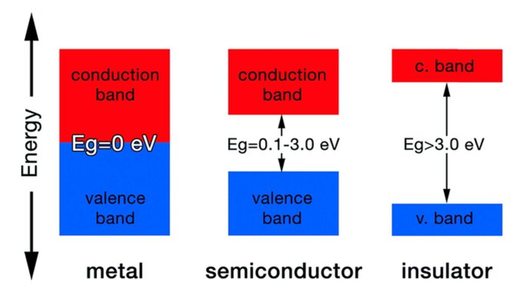

# BandGapAlign: Band Gap and Band Alignment Prediction of Semiconductors using Machine Learning

*This project is ongoing and subject to continuous advancements and modifications.*

## Overview

BandGapAlign is a machine learning project focused on predicting the band gap and band alignment properties of semiconductors. This tool aims to support material scientists and researchers by providing reliable predictions based on semiconductor features, enabling more efficient discovery of materials for electronic and optoelectronic applications.



[Source: Review on Charge Carrier Transport in Inorganic and Organic Semiconductors](https://www.researchgate.net/publication/374093083_Review_on_Charge_Carrier_Transport_in_Inorganic_and_Organic_Semiconductors/figures?lo=1&utm_source=google&utm_medium=organic)

## Features

- Predicts band gap values of semiconductors
- Provides band alignment classifications
- Utilizes machine learning algorithms for accurate prediction

## Installation

Clone this repository:
```bash
git clone https://github.com/Adrita-Khan/BandGapAlign.git
cd BandGapAlign
```

## Learning Resources

### Educational Videos

| # | Title/Link |
|---|------------|
| 1 | [Video 1](https://www.youtube.com/watch?v=DxQbakJXHMU) |
| 2 | [Video 2](https://www.youtube.com/watch?v=dJRpjK1UyPI&t=192s) |
| 3 | [Video 3](https://www.youtube.com/watch?v=dU123Uc7HlI) |
| 4 | [Video 4](https://www.youtube.com/watch?v=qg3ju4nqqoQ) |
| 5 | [Video 5](https://www.youtube.com/watch?v=vVXD1Ds4Efk) |
| 6 | [Video 7](https://www.youtube.com/watch?v=JYz51Wq3yEo) |

### Reading Materials

| Resource | Description |
|----------|-------------|
| [NIST Publication – Machine Learning for Materials Science](https://tsapps.nist.gov/publication/get_pdf.cfm?pub_id=915933) | Government publication on ML applications |
| [Getting Started in Materials Informatics](https://towardsdatascience.com/getting-started-in-materials-informatics-41ee34d5ccfe/) | Introductory guide to materials informatics |
| [Matminer Feature Guide](https://enze-chen.github.io/mi-book-2022/chapters/08/matminer_features_blank.html) | Guide to feature engineering (E. Chen, 2022) |
| [Computational Materials Science – Beginner's Guide](https://techbuzzonline.com/computational-materials-science-beginners-guide/) | Overview of computational approaches |
| [Machine Learning for Materials Scientists (ChemRxiv)](https://chemrxiv.org/engage/api-gateway/chemrxiv/assets/orp/resource/item/60c74ab3337d6ccdf3e27961/original/machine-learning-for-materials-scientists-an-introductory-guide-towards-best-practices.pdf) | Comprehensive introductory guide with best practices |
| [ACS – Machine Learning for Materials Chemistry](https://pubs.acs.org/doi/10.1021/acs.chemmater.2c01333) | Peer-reviewed article on ML applications |
| [Springer – Review on ML for Materials](https://link.springer.com/article/10.1007/s11467-023-1325-z) | Academic review of ML in materials science |
| [ScienceDirect – Machine Learning in Materials Discovery](https://www.sciencedirect.com/science/article/pii/S2666523923001575) | Research on ML-driven materials discovery |
| [Nature – Machine Learning for Materials Design](https://www.nature.com/articles/s41524-022-00884-7) | High-impact publication on materials design |

## Research Resources

### Academic Search Queries

Use the following search queries on Google Scholar to find relevant research papers:

| Query | Focus Area |
|-------|------------|
| `"band gap" "band alignment" "semiconductor" "machine learning"` | ML-based band gap and alignment predictions |
| `"band gap" "band alignment" "semiconductor" "deep learning"` | Deep learning approaches for semiconductor properties |

### Notable References

1. Band gap and band alignment prediction of nitride-based semiconductors using machine learning (Huang2019)
2. Bandgap prediction by deep learning in configurationally hybridized graphene and boron nitride (Dong2019)

The complete list of references can be found [here](References.md).

### Related GitHub Repositories

| Repository | Author | Description |
|------------|--------|-------------|
| [Band-Gap-Prediction-Using-ML](https://github.com/aydinerol/Band-Gap-Prediction-Using-ML) | aydinerol | Band gap prediction using machine learning |
| [Band_Gap_Machine_Learning](https://github.com/tianshi-wang/Band_Gap_Machine_Learning) | tianshi-wang | ML techniques for bandgap prediction |
| [Material-Band-Gap-Prediction](https://github.com/ShashankRapolu07/Material-Band-Gap-Prediction) | ShashankRapolu07 | Material band gap prediction using ML |
| [Machine-learning-enabled-band-gap-prediction](https://github.com/gaochanut/Machine-learning-enabled-band-gap-prediction) | gaochanut | ML-enabled bandgap predictions |
| [Band_gap-prediction-using-machine-learning](https://github.com/PrathameshSonar2000/Band_gap-prediction-using-machine-learning) | PrathameshSonar2000 | ML approaches for bandgap predictions |
| [Band-Gap-Prediction-via-Machine-Learning-Techniques](https://github.com/jairothoniel/Band-Gap-Prediction-via-Machine-Learning-Techniques) | jairothoniel | Machine learning methods for predicting band gaps |
| [BandGap_Predictor](https://github.com/Ezhilvel/BandGap_Predictor) | Ezhilvel | Bandgap prediction model using ML |
| [BandGap_Predictor](https://github.com/Sahil1004/BandGap_Predictor) | Sahil1004 | Predictive modeling for band gaps |
| [BandGapPredictor](https://github.com/yzhuo33/BandGapPredictor) | yzhuo33 | Machine learning for bandgap predictions |

## Databases and Tools

| Resource | Description |
|----------|-------------|
| [Matminer Datasets](https://hackingmaterials.lbl.gov/matminer/matminer.datasets.html) | Collection of datasets for materials informatics research by the Hacking Materials Project |
| [Next-Generation Materials Project](https://next-gen.materialsproject.org/) | Comprehensive resource for materials data supporting computational materials science |

## License

This project is licensed under the MIT License.

## Contact

**Adrita Khan**  
[Email](mailto:adrita.khan.official@gmail.com) | [LinkedIn](https://www.linkedin.com/in/adrita-khan) | [Twitter](https://x.com/Adrita_)
